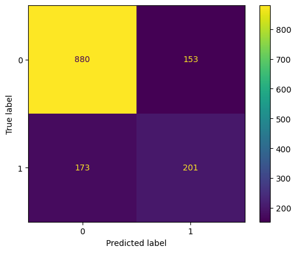
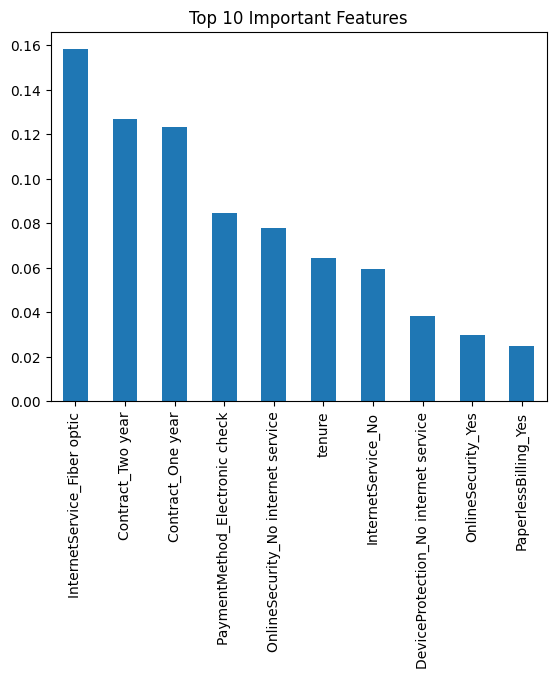
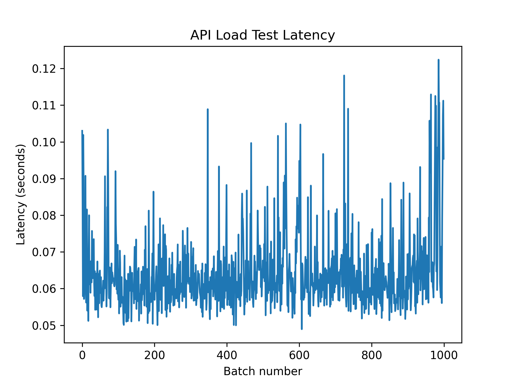

# Customer Churn Prediction API

An end-to-end machine learning system that predicts **customer churn in a telecom company** and exposes the model through a production-ready API.

The system includes:

- data preprocessing
- feature engineering
- model training and evaluation
- API deployment
- containerization
- load testing and performance benchmarking

## Business Problem

Subscription-based companies such as telecom providers face significant revenue loss due to customer churn. Identifying customers likely to churn enables businesses to take proactive retention actions such as targeted promotions or improved support.

This project builds a machine learning model to predict customer churn using customer demographics, service usage, and account-related features.


## Project Overview

This project implements an end-to-end machine learning pipeline for customer churn prediction using historical telecom data.

The trained model is deployed via a FastAPI REST API to enable real-time predictions. The workflow includes data preprocessing, feature engineering, model training, evaluation, containerized deployment with Docker, and API load testing.


## Tech Stack

The system is built using the following technologies:

- Python
- FastAPI
- Scikit-learn
- Pandas
- Matplotlib
- Docker

These tools enable building a production-style machine learning service with reproducible training and scalable deployment.


## Project Structure

```
Customer_Churn_Prediction
│
├── src/                # FastAPI application
├── models/             # trained model artifacts
├── data/               # raw and processed datasets
├── notebooks/          # EDA and model development
├── reports/            # evaluation results and benchmarks
├── logs/               # application logs
│
├── Dockerfile
├── Makefile
├── requirements.txt
└── README.md
```


## Machine Learning Pipeline

The prediction system follows the following pipeline:

1. Input validation using Pydantic schemas
2. Feature alignment using the stored feature list
3. Feature scaling using a trained scaler
4. Prediction using the trained classification model

Saved artifacts:

models/
- churn_model.pkl
- scaler.pkl
- model_features.pkl

These artifacts ensure that the same preprocessing steps used during training are applied during inference.

### Model Performance Comparison

| Model | ROC-AUC Score |
|------|---------------|
| Logistic Regression | **0.834** |
| Random Forest | 0.814 |
| XGBoost | 0.805 |
| K-Nearest Neighbors | 0.781 |
| Decision Tree | 0.657 |

### Key Insights

- Evaluated **five different machine learning algorithms** to compare predictive performance.
- **ROC-AUC** was used as the primary evaluation metric for this binary classification problem.
- **Logistic Regression achieved the highest ROC-AUC score (0.834)** and was selected as the final model for deployment.


## Model Evaluation

The trained model was evaluated on a held-out test dataset.

Evaluation results and artifacts are stored in:

reports/

Key outputs include:

- confusion matrix
- feature importance visualization
- model performance metrics

Example artifacts:

reports/
- Confusion_matrix.png 


- feature_importance.png


- model_performance.csv 


## API Endpoints

The trained model is exposed through a REST API built using FastAPI.

### Health Check

Endpoint used to verify that the service is running.

GET /health

Example response:

{
  "status": "healthy"
}


### Churn Prediction

**POST /predict**

This endpoint accepts customer data and returns a churn prediction.

**Example Request**

<pre><code class="json">
{
  "Gender": "Male",
  "SeniorCitizen": 0,
  "Partner": "Yes",
  "Dependents": "No",
  "tenure": 10,
  "PhoneService": "Yes",
  "InternetService": "Fiber optic",
  "Contract": "Month-to-month",
  "MonthlyCharges": 75.5
}
</code></pre>
**Example Request**
<pre><code class="json">
{
  "churn_prediction": 1,
  "churn_probability": 0.82
}
</code></pre>

## Docker Deployment

The API is containerized using Docker to ensure reproducible execution across environments.

Build the Docker image:

docker build -t churn-api .

Run the container:

docker run -p 10000:10000 churn-api

Once running, the API documentation can be accessed at:

http://localhost:10000/docs


## Dataset

This project uses the **Telco Customer Churn dataset**, which contains customer demographics, services subscribed, and account information.

Key features include:

- customer tenure
- service subscriptions
- contract type
- billing information
- monthly charges


## API Load Testing

Synthetic customer requests were generated to simulate API usage and measure response latency.

Artifacts are stored in:

reports/Model_Latency_&_User_Logs

- latency_plot.png 
- load_test_logs.csv

Average API latency during testing: ~80 milliseconds.


